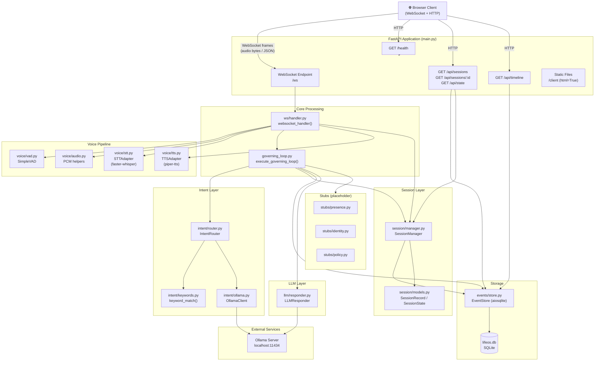
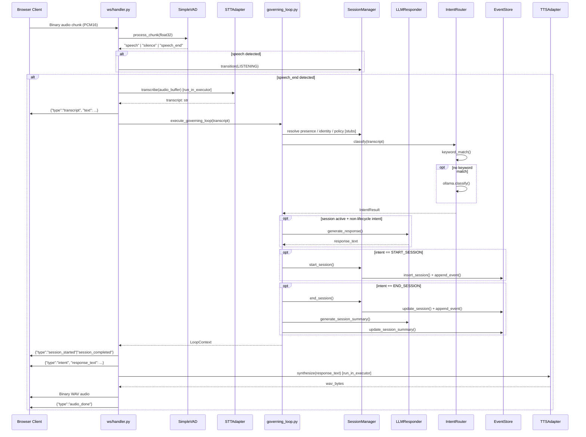
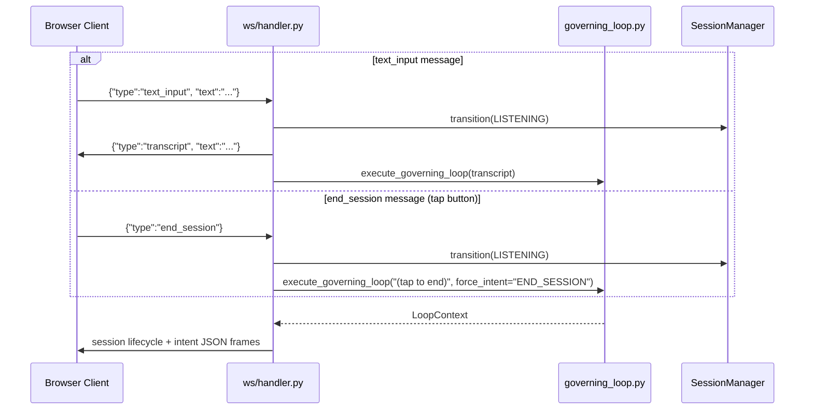
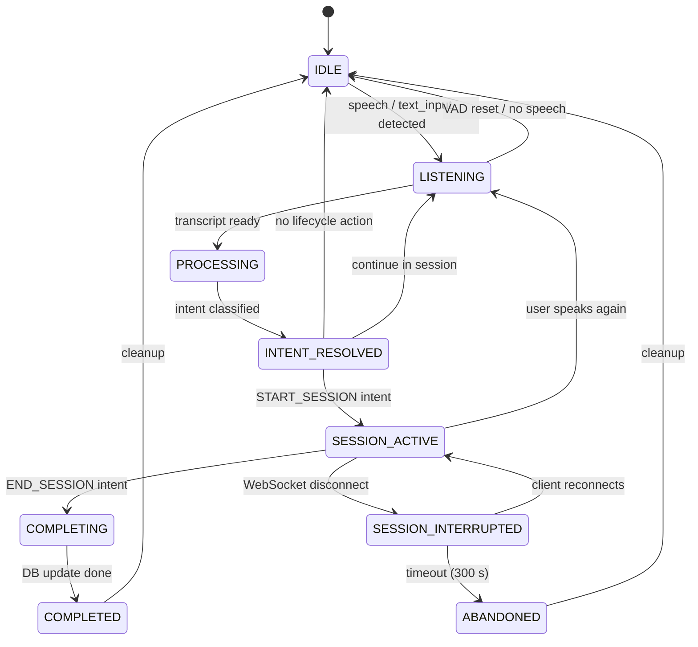
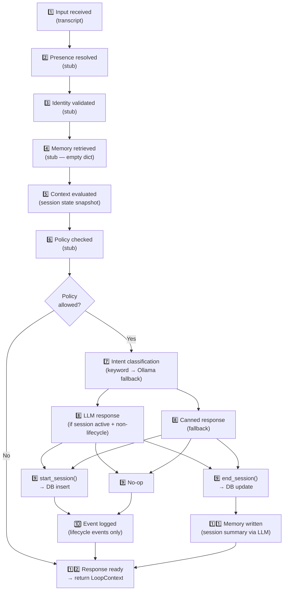
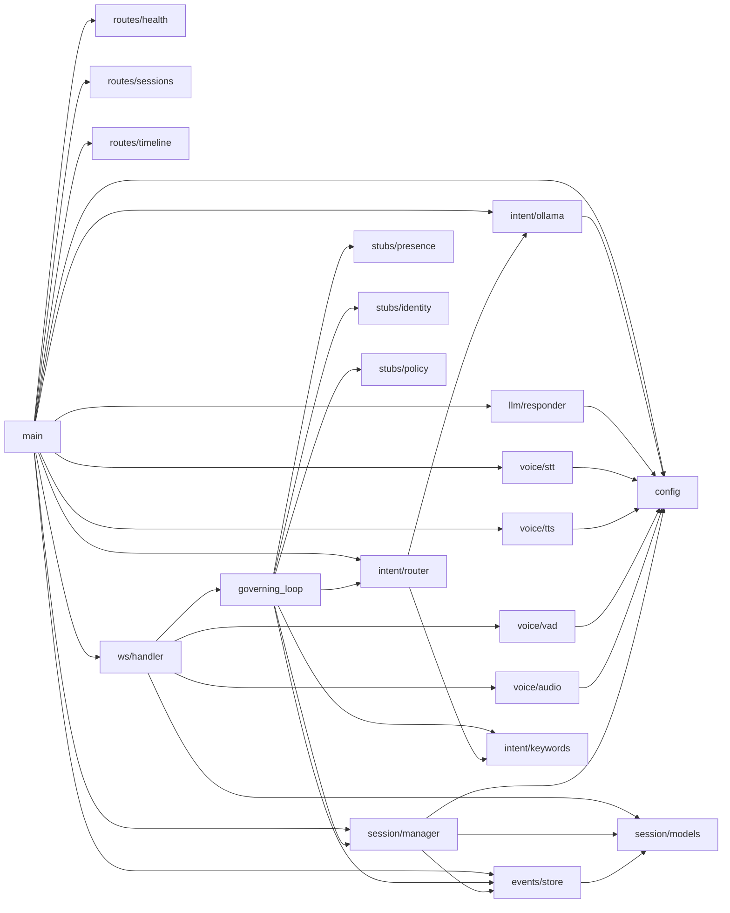

# LifeOS Voice Server — Architecture

---

## 1. High-Level Component Map



---

## 2. Request Lifecycle — Audio Path



---

## 3. Text / Tap-to-End Path



---

## 4. Session FSM (Finite State Machine)



---

## 5. 12-Step Governing Loop



---

## 6. Module Dependency Graph



---

## 7. Data Storage Schema

```mermaid
erDiagram
    SESSIONS {
        TEXT session_id PK
        TEXT status "active | completed | abandoned"
        TEXT session_type "default: focus"
        TEXT started_at
        TEXT completed_at
        TEXT abandoned_at
        INTEGER duration_ms
        TEXT intent_transcript
        TEXT completion_transcript
        TEXT summary
        TEXT created_at
    }

    EVENTS {
        TEXT event_id PK
        TEXT event_type "session.created | session.completed | session.interrupted | session.abandoned | session.resumed"
        TEXT session_id FK
        TEXT timestamp
        TEXT payload "JSON blob"
        TEXT idempotency_key UNIQUE
        TEXT created_at
    }

    TIMELINE_VIEW {
        TEXT entry_id
        TEXT session_id
        TEXT text
        TEXT timestamp
        TEXT type "completed | abandoned | other"
    }

    SESSIONS ||--o{ EVENTS : "has"
    SESSIONS ||--o{ TIMELINE_VIEW : "shown in"
```
